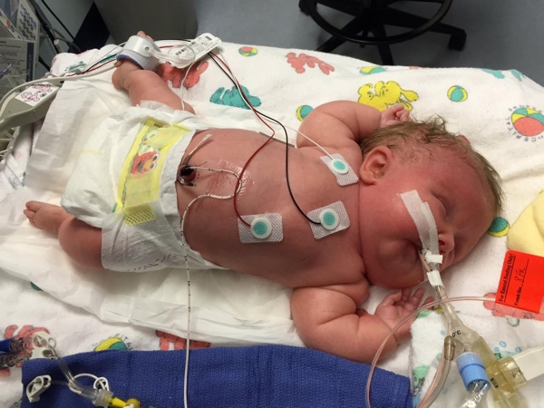

1/1/2015 Team Everly Update — If Tuesday and Wednesdays were steps forward, today felt like a step back. Hopefully that feeling is just the exhaustion bubbling up.

[ If you are just jumping into our updates, our daughter Everly was born on December 28. She has OI, which is short for Osteogenesis Imperfecta. It's commonly called brittle bone disease. It means she fractures her bones easily. She was born with at least 40 fractures in her ribs, arms, legs and her clavicle. She has one of the more severe types. Because of the irregular shape of her ribs, Everly's lungs didn't have the room to grow into big lungs. As far as her medical prognosis, she's in a grey area. One of the residents we trust says he or she has seen babies similar to Everly who have made it... and some who have not. We are thankful God is in control and one of the reasons we're being so open about Everly's journey so we have an army of people who know how to pray for Everly. Will you join us in the fight? We so appreciate your support! ]

But first, here's some awesome things that happened today:

1. Everly's right leg has come way down. She was doing some crazy yoga since birth, and it's nice to see as she moves around, that she's settling into a more aligned position.

2. Everly is still stable and she's one day older. Each day we get to hang out with her is a blessing. Each day gives us more hope that one day we'll look up and say, wow it's been 30 days, then 365 days, then years and we'll know we're out of the woods.

3. There are no negative effects from PAM treatment so far. (That's short for pamidronate, a drug that helps strengthen bones and lessen pain for those with brittle bone disease.) We're so thankful she was able to start the treatment so young.

4. We are getting to know Everly's caregivers and trusting them more and more.

5. We're learning a heck of a lot and know the type of questions to ask to make sure Everly is getting the best care. Someone studying their fellowship today asked if I had a medical background while talking to me. We are much more comfortable with hospital politics and lingo.

6. Colby and I are incredibly lucky to have love from eachother, our family, our friends, our work, and our doctors. Everywhere we look, we see God's love in the form of His creation at work—times three.

7. Everly is still super cute.

8. Our family is becoming stronger because we are living through tough times together.

Ok, here's a rundown of the last 24 hours. Early in the morning when the earth was just rolling into 2015, the medical team worked at shifting Everly's head a little bit. Her neck isn't strong enough for her to move it on her own and it's not healthy for her to be in the same position for long periods of time. The team also adjusted her breathing tube so it was lower and in the right place. Everly didn't like both of these things at all.

As she freaked out, the team increased her pain medicine and oxygen support and she has a new normal. Up from 3 to 4 micrograms of the pain medicine fentanyl an hour and she was receiving 90 percent oxygen through the night. In addition to this, the team switched her ventilator settings and the ventilator is now initiating many of Everly's breaths when before she was initiating all breaths.

She's still on the higher level of base pain medicine as well as the new ventalitor settings, but we have been able to bring her oxygen down to 55 percent in the late morning and even lower to now 48 percent.

This episode from early this morning is discouraging because the goal is for Everly to be able to breath all by herself down the road. She's very relaxed now because she's so drugged up. We hope it's a rebuilding day for her: a day of rest that allows her to fight stronger in the coming days.

When I polled our OI support group how long their baby had been in the NICU before Everly was born, I got multiple answers: 1 week, 2 weeks, 2 months, 3 months, 9 months. Colby and I are figuring out our new normal and getting ready for marathon mode.

There's many ways to put it, but our main prayer is still the same. Please pray that Everly will become stronger and better able to breath on her own so we can dial down her breathing support.

Also pray that God will draw us all closer to him and that He'll use Everly to make Himself more weighty in our lives. We praise God for everything He's providing. We have a daughter. She is awesome. She is alive. We get to hang out with her. She has a fighting chance.

Thank you so much for the prayers!

-Team Everly
