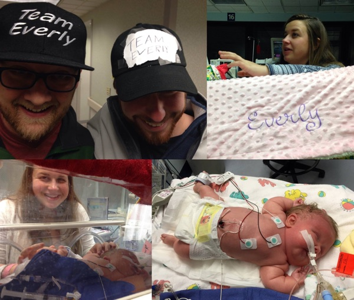

1/2/2015 Team Everly Update — Today we learned a hospital will suck your energy dry if you stay inside it all day and don’t get out for a walk. We didn’t get to the walk.

Everly is doing well overall. She’s stable but she has been more fussy than normal. Her breathing assistance hasn’t changed, it just has fluctuated based on Everly’s mood.

In one instance I know why she was fussy. That thing I heard through her plastic bed was what I thought it was. Let’s just say Everly is very good at taking out the trash. I know because I helped change Everly’s diaper for the first time today.

Right now, Everly don’t got no time for people messing with her. She’s clearly an introvert. So far we know she gets fussy when she has a dirty diaper, when you move her, when it’s too bright and when she’s in pain.

It seems like she prefers it if you just hold her hand rather than stroking her arm or legs. Her little fingers are so fun to touch. I expect she won’t enjoy hugs or holding hands as a teenager though so I’m going to hold her hand while I can.

Today we met with another OI parent in the hospital hallway. It was extremely encouraging. The bond you have with another OI family is quick and solid. It’s like walking through a mall and finding the only other 8-foot person with a mohawk. You both are such a rare breed that you instantly make a connection. You bond over what it’s like to duck through doorways and you reminisce how everyone thinks you’re in a punk band, but really, you just like the look.

The medical team has been great. Tuesday we’re having a meeting with all the various teams working with Everly to make sure we are all on the same page and have a strategy going forward. It’s such a relief the team is proactive.

In other care news, we increased how much milk we’re giving Everly through a feeding tube. We stopped giving Everly antibiotics because there is no longer risk of fever, which was a possible side effect from her first pamidronate treatment. “PAM” treatments are one of the ways you can help strengthen OI babies’ bones and help with pain management.

We got back an ultrasound of Everly’s head. She has a touch of blood on the edge of her right ventricle in her brain. This is something that’s more common with premature babies. It’s a potential issue. It either will heal up, or could lead to neurological issues, but there are ways to treat it if it comes to that. We’ll know more after watching it for a week or two.

We are also seeing how Everly does with 6-hour doses of Tylenol. It’s too early to know how the experiment is doing. We’re hoping that adding Tylenol to the mix will help us ween Everly off her other pain medicine, Fentanyl. We don’t want her to get too used to it as it’s an opioid. In other words, you need more of it to get the same effect the longer you take it and it makes you drowsy. We want Everly to workout those lungs and get them buff rather than just chill out. Plus, if you over use one pain medicine, it can become less effective for you later on when you could really need it.

We sleep better at night knowing someone gets Everly and gets us. Unfortunately, we had a rare day today and we weren’t thrilled with Everly’s care during the day shift. Because of that, we spent as much time as we could in the NICU till the end of the day shift to make sure Everly was getting what she needed.

We learned you can request the NICU nurses you love and ask that certain ones aren’t on your rotation. We have been bonding with most of our caregivers, but we do have a “varying degree of confidence” with each nurse as the Vandy counselor assigned to us put it. We shared our preferences, so it’s a relief the person doing the schedule will have this information going forward.

After we met the night shift nurse, we realized we lost Colby’s phone. We spent another hour trying to triangulate it with the Find My iPhone app, but it’s still a mystery. That's on the list for tomorrow.

Colby’s recovery from a c-section is going well. She’s walking by herself much more and she is walking faster. Things like going over bumps in the car still bother her. I will miss making Colby laugh while she’s recovering from a c-section. Have you ever seen someone cracking up while trying desperately not to crack up at the same time?

Today lesson: Stop trying to be superman and go take the walk you need. Tomorrow we’ll try that.

Please pray that:

- Everly will be able to breathe more on her own.
- That we’ll know what she needs when she’s fussy.
- That Everly will be calm and not overexert herself so she can heal up and grow stronger.
- That the dried blood in Everly’s brain isn’t a sign of larger issues.
- That we’ll figure out the best combination and strategy for pain management.
- That God will bring us closer to Him.

Thanks so much everyone for the love and support. We’ve learned about so many inspiring stories. People tell us how they are fighting for us and they share how their fight informs ours.

On Sunday we celebrate Everly’s first week being with us. Everly has already overcome so much and God has provided us with so very much.

Much love from Team Everly!
