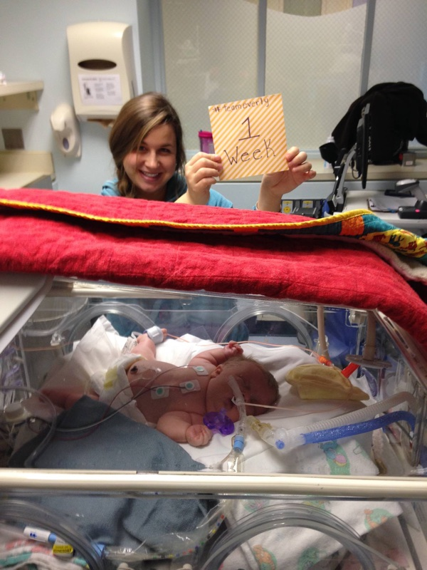

1/4/2015 Team Everly Update — We celebrated Everly’s first week with us! We worked on optimizing her pain management today. And… I had a meltdown in the shower.

We celebrated Everly’s first week with us today by getting some fancy burgers. Every also got a few small gifts, which she can’t keep in her bed yet, since they could be carrying germs. We’ll spoil you later Everly! It’s crazy that a week ago, we were just getting to the hospital.

It’s about time for Everly’s umbilical cord IV to expire because the vein in her umbilical cord naturally closes up. The medical team isn’t ready to try putting in a second IV, so we’re working on transitioning her to medicine she can take orally.

Today we worked on bringing Everly off her current primary pain medicine, Fentanyl, which can only can be administered via IV. The team put her on a base dose of morphine and has been dialing back the Fentanyl every few hours.

She’s agitated and the doctor on call today thinks it’s because we’re changing her medicine up and she’s still getting used to the transition. It’s been hard seeing Everly agitated. When her heart rate is up, mine is. This must be what parenthood feels like.

We also have been figuring out how much milk we should be feeding Everly. The doctors want to give her as much as a typical baby her size would eat. Though we’ve heard from OI parents overfeeding OI babies can be bad news.

Potential risks involve reflux, aspiration, and the extra weight of food in the stomach can press against the lungs and diaphragm affecting breathing. All OI parents we’ve talked with have said their child eats small meals frequently, rather than bigger meals less often.

We’re getting the right people involved at the hospital and we’re learning how to push back in areas where we feel like we know a bit more than the doctors. I know, it sounds bizarre, but consider this.

When you ask someone how many OI babies they have seen, the answer is often none, or they have seen one a long time ago and that baby was less severe.

In the area of OI, we are becoming experts by necessity. With our new OI network of parents and in some cases doctors across the world, we are learning which issues we need to push our medical team on.

It’s been a blur of celebrations and hardships. They all run together and it’s hard to tell when one starts and the other begins. My brother hugged me on the day Everly was born.

“Congratulations,” he said.

“Most awkward congratulations ever,” I said.

I needed that hug because I was 1 part thrilled Everly made it and 2 parts scared how she was progressing.

Today Everly is a week old and she’s making progress. She isn’t getting worse. That is a huge victory and gift from God.

Even so, today I had my biggest breakdown since Everly’s birth. I hated seeing Everly so agitated while we’ve been transiting her medicine. I also saw her leg being handled the wrong way and I confronted a caregiver.

But the biggest thing that set me off was this. While Colby and I were trying to get an update on how Everly was doing today, all I could hear were *BEEPS* telling me Everly wasn’t happy.

I’m so tired of beeps.

I know what every beep in the NICU means.

The chirp by her ventilator means we can’t go any higher on how much pressure we’re pumping into her lungs or we could risk causing damage.

The exit alarm beep above her bed is an alert thinking Everly needs warmed because a rush of cold air hits the sensor when the bed’s top is up.

The abrupt beep by the infusion pumps is when a dose of something has ended.

The faster beep goes off when a caregiver pauses one of the infusions. You have to keep repausing something every 10 minutes or so if you’re scared two infusions may interact with each other negatively.

The beep by her monitor is a tricky one. You have to glance over to see if it’s a happy beep or a sad beep, but they sound the same. The caregiver sets a range and if the amount of oxygen that’s saturated in Everly’s blood goes above or below that range, it beeps.

If oxygen saturation levels get real low, the beep by the monitor gets louder. If that loud beep beeps so many times, it means your baby’s lungs or heart could stop working at any minute. We’ve only heard that one beep a few times so far.

Sometimes I don’t know which baby a beep is for. A turn of the head can help figure out if a beep is for my daughter or for another baby. Sometimes caregivers walk across the room and end up at the wrong bed because they heard a beep wrong.

You can click a button on the monitor to pause beeps for a minute or so, but it doesn’t make me less stressed. I still hear those beeps when numbers are flashing.

In fact, when I sit on my bed at night, the beeps are still sounding off in my head.

These are the beeps I hear when I look into my daughter’s face. It all got to me and I took the time to break down today.

It gave me strength to try it all again a different way tomorrow. Hopefully when Everly is having her fits, she’s strengthening up her muscles and the workout will do her well when she has to jump into future battles.

Someone on the medical team gave me some good advice. Watch the caregiver’s face. If they aren't alarmed, you shouldn’t be alarmed.

I’m learning how to trust the system, and more importantly trust God.

Tomorrow Colby and I will both be back home and we’ll figure out a new schedule for visiting Everly since we’ll be a bit farther away now. It should be better in the long run though. It’s official marathon mode and I’m so happy we’ve gotten to this point.

Today’s lesson: Ignore the beeps. Look at faces and learn what you need to know. I’ve got a lot to learn by looking into Everly’s.

Please pray that:

- Everly will be able to breathe more on her own.
- God will bring us all closer to Him.
- Everly will calm down and react to her new pain management plan.
- We learn how to best work with the medical team.
- We learn the best amount of milk to feed Everly.

Much love from Team Everly,