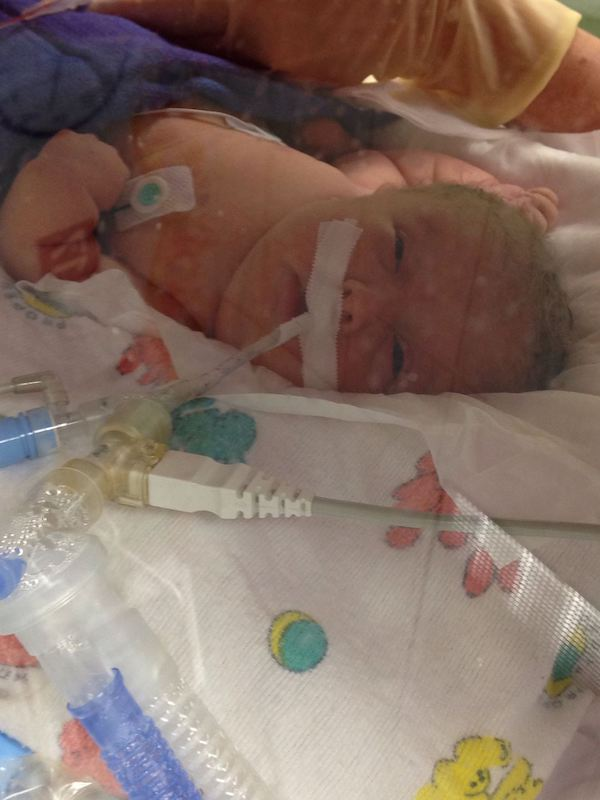

An evening update: Everly is still stable and we are seeing mild promising indicators that's she's fighting hard and slowly, slowly getting stronger.

Yesterday she was being given 100% oxygen. It's fluctuated a bit throughout the day but is now less than 45%. We want her at 21%. More important, the amount of pressure the ventilator is using has been dialed a hair down as well, like 2-4% less overall pressure.

We consulted with the Endocrinoloy team. We know she has brittle bone disease (osteogenesis imperfecta). Likely type 2 or 3, some of the more severe types.

We are excited for tomorrow as it will Everly's first pamidronate infusion treatment. This is a medicine that will start to help strengthen Everly's bones and it will also help with pain management because she is healing from broken bones. She could get a fever due to starting treatment.

In other good news we don't see evidence that there were any new breaks from delivery via c-section which is amazing given she has so many from just chilling in the womb. The doctors were able to lift her out while she was still protected by the amniotic fluid sac, which requires mad skills.

Please continue to pray for our underdog. Praise God He has brought Everly this far. Love y'all!
